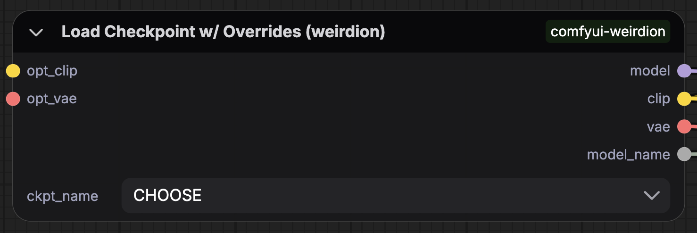
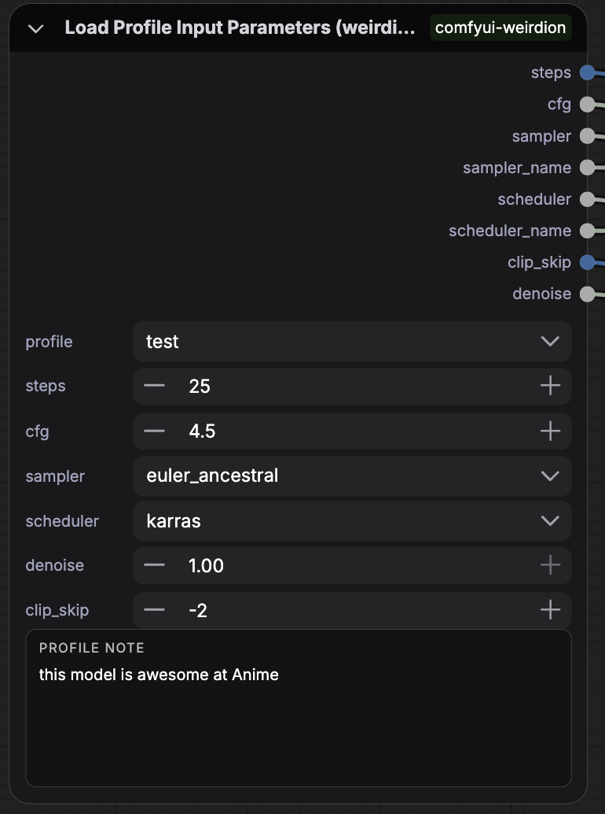
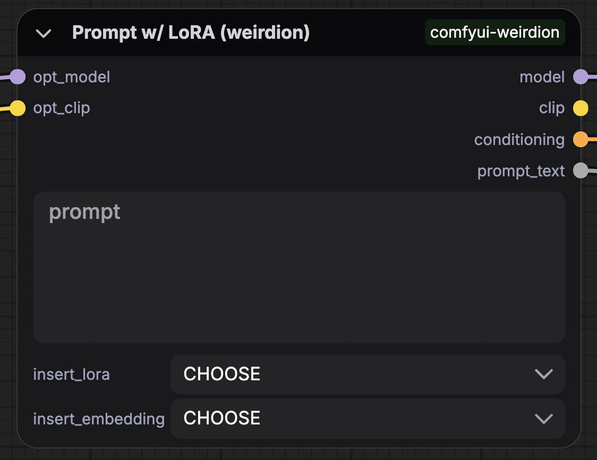
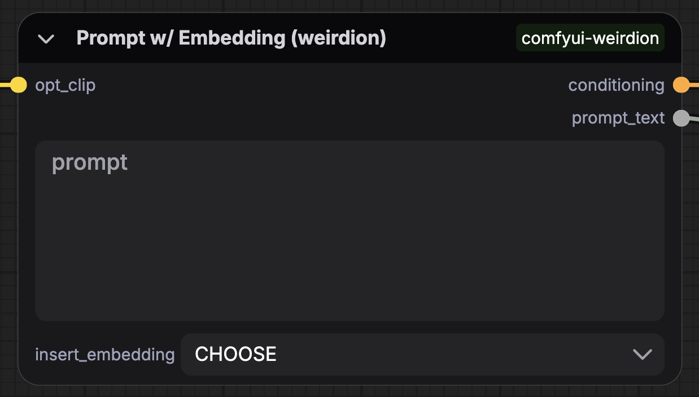

# ComfyUI weirdion

I built this to bring some order to my ComfyUI chaos and fit my own workflow. If it helps you too, awesome.

For setup and development details, see [DEVELOPMENT.md](DEVELOPMENT.md).

## The Nodes

Here’s the quick rundown. Short and sweet.

### Load Checkpoint w/ Overrides
> Load a checkpoint, but let you swap in your own CLIP and/or VAE if you want.

- Inputs: `checkpoint`, optional `opt_clip`, optional `opt_vae`
- Outputs: `model`, `clip`, `vae`, `model_name`
- Notes: if `opt_clip` or `opt_vae` is connected, it overrides what the checkpoint loaded.

  
Screenshot

  

### Load Checkpoint w/ Clip Skip
> Same as above, but bakes in clip skip so you can drop the extra node.

- Inputs: `checkpoint`, `clip_skip`, optional `opt_clip`, optional `opt_vae`
- Outputs: `model`, `clip`, `vae`, `model_name`, `clip_skip_value`
- Notes: `clip_skip` follows ComfyUI rules (-1 = no skip).

  
Screenshot

  

### Load Checkpoint w/ Profiles
> One node to load a checkpoint, apply clip skip, and pull profile parameters.

- Inputs: `checkpoint`, `profile`, `steps`, `cfg`, `sampler`, `scheduler`, `denoise`, `clip_skip`, optional `opt_clip`, optional `opt_vae`
- Outputs: `model`, `clip`, `vae`, `model_name`, `steps`, `cfg`, `sampler`, `sampler_name`, `scheduler`, `scheduler_name`, `clip_skip`, `denoise`
- Notes: profile defaults auto-fill inputs, but you can override them per run.

  
Screenshot

  

### Load Profile Input Parameters
> Resolve steps/cfg/sampler/scheduler/denoise/clip skip from a saved profile.

- Inputs: `profile`, `steps`, `cfg`, `sampler`, `scheduler`, `denoise`, `clip_skip`
- Outputs: `steps`, `cfg`, `sampler`, `sampler_name`, `scheduler`, `scheduler_name`, `clip_skip`, `denoise`
- Notes: use this when you want profile params without loading a checkpoint.

  
Screenshot

  

### Prompt w/ LoRA
> A prompt box that understands `<lora:name:strength>` and can load them for you.

- Inputs: `prompt`, `lora`, `embedding`, optional `opt_model`, optional `opt_clip`
- Outputs: `model`, `clip`, `conditioning`, `prompt_text`
- Notes: tags stay in `prompt_text` for metadata, but conditioning is encoded without LoRA tags.

  
Screenshot

  

### Prompt w/ Embedding
> Simple prompt + embedding dropdown. Optional CLIP encoding.

- Inputs: `prompt`, `embedding`, optional `opt_clip`
- Outputs: `conditioning`, `prompt_text`
- Notes: if no `opt_clip`, this is just a text passthrough.

  
Screenshot

  

## Contributing

This is a personal repo, but issues and PRs are welcome if they fit the vibe.

## License

See [LICENSE](LICENSE) file.
